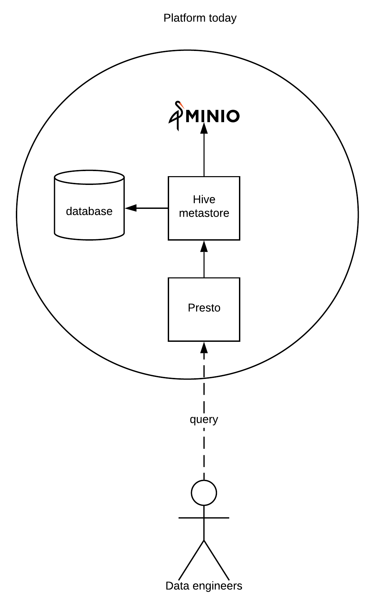

# Readme
* [Offer example 1](example1/example1.md)
* [Offer example 2](./example2/example2.md)
* [Offer example 3](./example3/example3.md)
## What you can do with platform
1. Upload/Download files via User Interface
2. Upload/Download files via API
3. Query using SQL (Schema dependent - DVML2 api), supported files: csv, xml, json, ...
4. Data processing in near-real-time/batch (reports, alerting, monitoring, ML, ...)
5. Give access to 3rd party (export/import data)
## Diagram
Platform today

